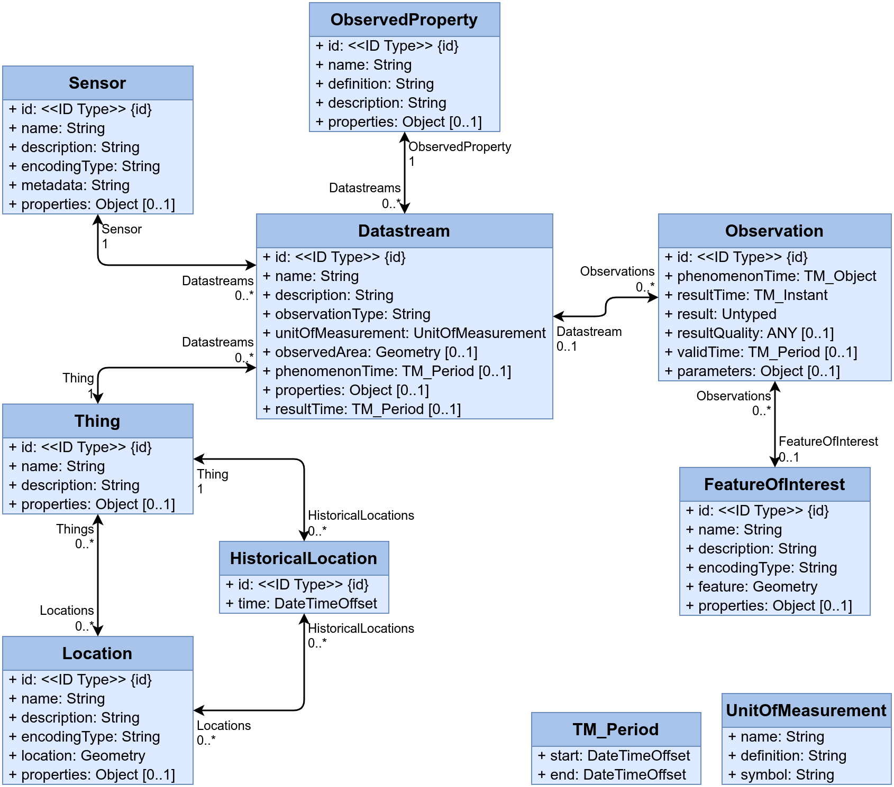

# st-utils

## What is it?

**st-utils** (SensorThings Utilities) is a suite of tools for managing networks of *heterogeneous* sensors using the [OGC SensorThings](https://www.ogc.org/publications/standard/sensorthings/) standards and data model.

## Capabilities

**Extract** observations from one or more sensors, **transform** the data to the OGC SensorsThings data model and **load** into a persistent PostgreSQL + PostGIS database.

First time deployment of `st-utils` involves:

1. The creation of a A PostgreSQL database with tables matching the OGC SensorThings models are created. This is handled in full by [`FROST-Server`](https://github.com/FraunhoferIOSB/FROST-Server),
2. Populating the database with the entities found in the sensor configurations (`sensor_configs`),
3. Start a sensor *stream* requesting observations from sensor APIs,
4. Incoming observations are extracted, trasnformed, and loaded to the correct database tables,
5. The stream keeps running, indefinitely until stopped,
6. Sensor networks are visualized at `http://localhost:8080/st-utils`, 

# Table of Contents

- [st-utils](#st-utils)
  - [What is it?](#what-is-it)
  - [Capabilities](#capabilities)
- [Table of Contents](#table-of-contents)
- [Deployment Methods](#deployment-methods)
  - [Environment Set-up](#environment-set-up)
    - [Step 1: Clone the Repo](#step-1-clone-the-repo)
    - [Step 2: Set Environment and Sensor Credentials](#step-2-set-environment-and-sensor-credentials)
    - [Step 3: Set Sensor Configuration Files](#step-3-set-sensor-configuration-files)
  - [Startup](#startup)
    - [Docker](#docker)
    - [Manual Installation / Deployment](#manual-installation--deployment)
- [Sensor Configuration Files](#sensor-configuration-files)
- [Contributing: Additional Sensor Support](#contributing-additional-sensor-support)
  - [Add a YAML Template for New Sensor Support](#add-a-yaml-template-for-new-sensor-support)
  - [Extract, Transform and Stream Functions](#extract-transform-and-stream-functions)
    - [Extract Function](#extract-function)
    - [Transform Function](#transform-function)
    - [Stream Function](#stream-function)
- [Supported Sensor Models](#supported-sensor-models)

# Deployment Methods

It is assumed the target system includes `git`. For sensors supported by `st-utils`, refer to [Supported Sensors](#supported-sensor-models).

## Environment Set-up

Before anything, the environment must be set-up to match your sensor network. Here, "sensor network" refers to physical collection of (supported) sensors for which you have the necessary credentials to connect to.

### Step 1: Clone the Repo
Begin by cloning the repository into the target machine and create a `.env` file at the project root:

```bash
git clone https://github.com/justinschembri/st-utils.git st-utils
cd st-utils
touch .env
```
### Step 2: Set Environment and Sensor Credentials
The default username used in all services, is `sta-manager`. This will be the username throughout, for both the database and the FROST server. The `.env` must include a value for the key `FROST_PASSWORD`.

Other than that, the `.env` must be populated with sensor API credentials. Credential requirements vary by sensor, see [supported](#supported-sensor-models) by `st-utils`. Example credentials might look like:

```json
NETATMO_CLIENT_ID = "67d2becabca425905a081d84"
NETATMO_CLIENT_SECRET = "4Itqudt6L8PcpSHT7oATXUcmogj12xYxbBGn46A676k"
NETATMO_REFRESH_TOKEN = "676414d415a6db50d5091272|82ee861f6539bae8bcb953615075eb2f"
```
### Step 3: Set Sensor Configuration Files
Similarly, populate the `sensor_configs` directory with configuration files for each of the sensors on your network. An empty directory exists for each supported sensor type. For more on setting up sensor configuration files, see [Sensor Configuration Files](#yaml-sensor-configuration-files).

## Startup

Deploy with Docker or a manual installation. 

### Docker

Deployment with Docker (requires `docker` and `docker-compose`) is the most straight-forward. Assuming the repository has been cloned, follow these steps:

1. copy the template `docker-compose.yml` file as `docker-compose.overide.yml`; your production credentials go here,
2. fill out the system passwords (note the `FROST_PASSWORD` and `POSTGRES_PASSWORD` must match)

Assuming your working directory is the project root:

```bash
cd st-utils/scripts
docker-compose up -p st-utils
```

This should spin up a server, persistent database and deploy the application. After the web-server and database are set up, you should see logs similar too:

```bash
2025-03-19 17:29:37    Building st-utils @ file:///app
2025-03-19 17:29:38       Built st-utils @ file:///app
2025-03-19 17:29:38 Uninstalled 1 package in 4ms
2025-03-19 17:29:38 Installed 1 package in 0.43ms
2025-03-19 17:29:38 2025-03-19 16:29:38: INFO - Sensor stream starts in 30s.
2025-03-19 17:30:09 2025-03-19 16:30:09: INFO - New Thing created at http://localhost:8080/FROST-Server/v1.1/Things(34)
2025-03-19 17:30:09 2025-03-19 16:30:09: INFO - New Location created at http://localhost:8080/FROST-Server/v1.1/Locations(1)
...
...
2025-03-19 17:30:10 2025-03-19 16:30:10: INFO - Retrieved 3 sets of observations.
2025-03-19 17:30:10 2025-03-19 16:30:10: INFO - New Observation created at http://localhost:8080/FROST-Server/v1.1/Observations(1)
2025-03-19 17:30:10 2025-03-19 16:30:10: INFO - New Observation created at http://localhost:8080/FROST-Server/v1.1/Observations(2)
2025-03-19 17:30:10 2025-03-19 16:30:10: INFO - New Observation created at http://localhost:8080/FROST-Server/v1.1/Observations(3)
...
```

### Manual Installation / Deployment

**st-utils** requires the following: 

- **Python 3.13**
- A running instance of [**`FROST Server`**](https://github.com/FraunhoferIOSB/FROST-Server) must be available; follow the official [instructions](https://fraunhoferiosb.github.io/FROST-Server/deployment/tomcat.html) for installation. `FROST Server` will handle connections and transactions with a `PostgreSQL` database with the `PostGIS` extension (all included in the instructions above).
- `Tomcat Apache` (a requirement for the ` FROST Server`)
- The `.env` file that includes the sensor credentials should also include the `FROST` endpoint, for example:
    - `FROST_ENDPOINT` = "\<END POINT URL\>" , e.g.:

```bash
FROST_ENDPOINT=http://localhost:8080/FROST-Server.HTTP-2.5.3/v1.1
```

Next, create the required venv and install the python library using [`UV`]() ...

```zsh
uv venv
uv pip install .
source .venv/bin/activate
```

... or `pip`:

```bash
python -m venv venv
source venv/bin/activate
pip install -r requirements.txt
pip install .
```

Ensure the FROST Server is running, and run the application:

```zsh
source .venv/bin/activate 
python src/sensorthings_utils/main.py
```

# Sensor Configuration Files

A requirement for deployment of the application are **sensor configuration files**: `YAML` files which contain five top-level keys, namely: `sensors`, `things`, `locations`, `datastreams` and `observedProperties`. A high-level template is provided in [`\sensor_configs`](sensor_configs/template.yaml). These five keys are equivalent to the main objects in the SensorThings datamodel:



Using the template for supported sensors, set up a real world sensor arrangement. Each file represents ONE sensor object and all its associations. Thus if you are setting up 10 sensors, you should expect to 10 sensor config files. `Locations`, `Things`, `ObservedProperties` MAY be common among different sensors, just make sure that the items are identical. The function which parses the configuration file will infer the items are the same, and not create two identical locations.

1. Copy the template, the filename should be the sensor MAC address,
2. Fill out all the details that remain pending, make sure to copy and paste identical items from one file to another to avoid creating duplicate entities later on.

# Contributing: Additional Sensor Support

Methods for accessing sensor observations vary across sensor brands. Some models will handle remote storage and provide web-based such as dashboards and APIs. Other configurations may include data-loggers, and more "DIY" solutions such as Arduino are also valid. Furthermore, the observations themselves are likely to use varying serialization schemas.

What **st-utils** offers is a standarized way of *Extracting, Transforming and Loading* (ETL) the data from a wide network of sensors. Support for various sensors brands is added progressively, requires the development of:

- A `YAML` configuration file template for a specific sensor brand ([Creating a YAML Config](#sensor-yaml-configuration-files))
- The design of 3 functions in a separate python file:
  - `_extract`
  - `_transform`
  - `stream`

For example, support for the Netatmo NWS03 is provided by `/sensor_configs/netatmo/netatmo_nws03.yaml`. The `netatmo.stream` function wraps `_extract` and `_transform` methods in the `netatmo.py` file.

## Add a YAML Template for New Sensor Support

To add support for a new sensor typology:

1. Make a new directory in the [`\sensor_configs`](sensor_configs), whose name should match the sensor name,
2. Using the general [template](sensor_configs/template.yaml), fill out the fields in the `sensors` and `datastreams` items.
3. Place a `.gitignore` to ignore all files in these directories, except for the template

## Extract, Transform and Stream Functions

Since every sensor is expected to be just a little bit different, a separate set of logic must be prepared for each newly supported sensor typology. In order to standardize the approach, for each new sensor we expect three functions: `_extract`, `_transform` and `stream`.

### Extract Function

The `_extract` function handles querying the observations from a sensor's data infrastructure. It shall return a `Dict[str, Dict[str, Any]]` object. The primary key should be some unique identifier: if multiple sensors are being queried there should be no confusion as to what data belongs to what sensor. All sensors should be queried at the same time, thus one object will be returned where each key is the unique reference to a specific sensor. The nested `Dict` should have keys which are the references to the datastreams available by that sensor and values which are the respective observation results.

### Transform Function

The `_transform` function essentially maps out the sensor native keys to the respective names of the datastreams found in the earlier prepared `YAML` configuration files. For example:

```python
# keys = sensor native key
# values = datastream names
NETATMO_TO_DATASTREAM_MAP = {
    "Temperature": "temperature_indoor",
    "CO2": "co2",
    "Humidity": "humidity",
    "Noise": "noise",
    "Pressure": "pressure",
    "AbsolutePressure": "absolute_pressure",
}
```

The `_transform` shall take a `Dict[str, Any]` and return a NamedTuple with fields `sensor_name (str)`, `datastream_name (str)`, `result (Any)`, `result_time (datetime)`.

### Stream Function

The stream function is a wrapper around the the `_extract` and `_transform` functions and returns a `Tuple[Observations, ...]`, and expects a `sleep_time (int)`.

# Supported Sensor Models

The following sensors are currently supported:

- [Netatmo Home Weather Station (NWS03)](https://www.netatmo.com/en-eu/smart-weather-station)


