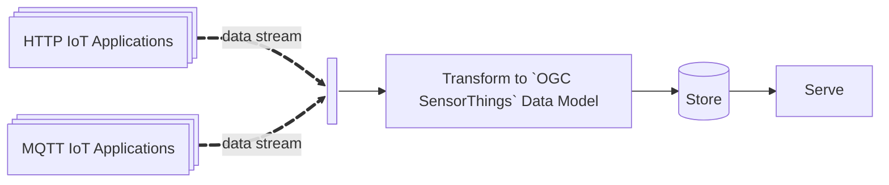
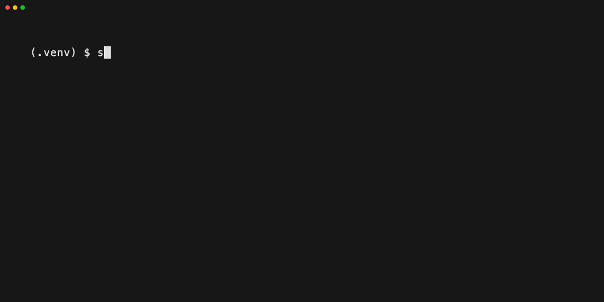
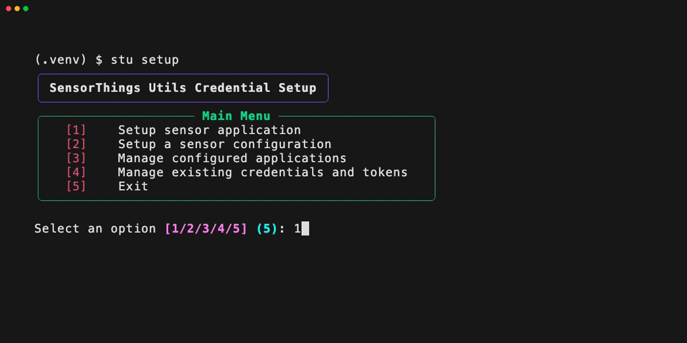
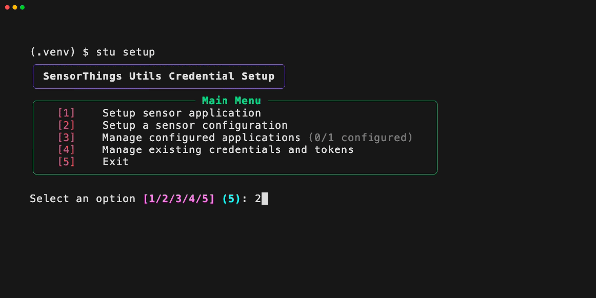
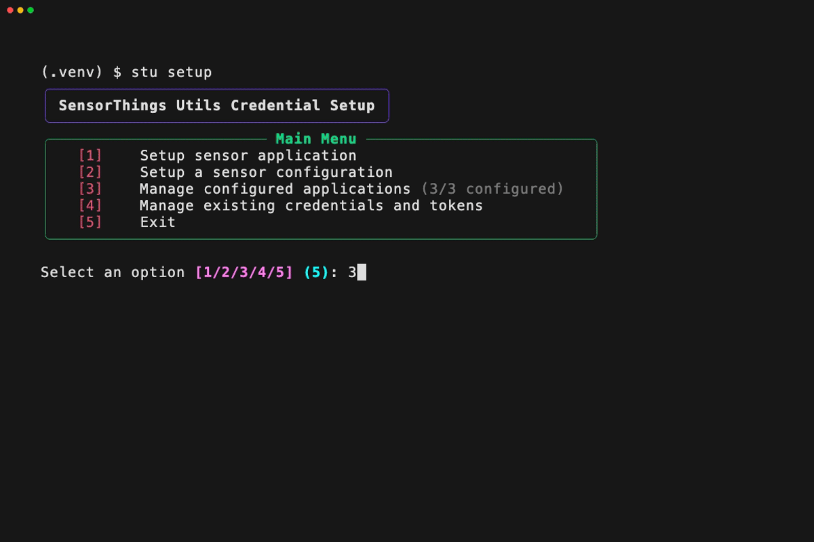
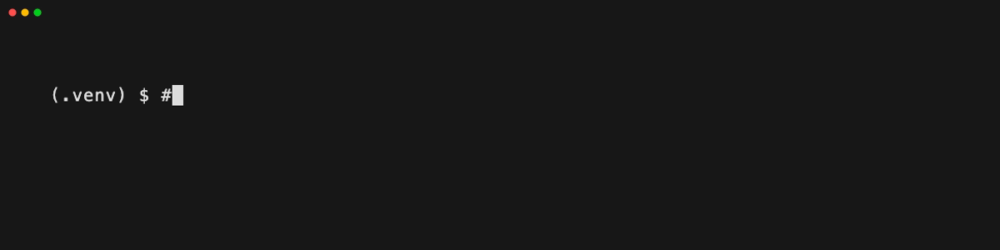
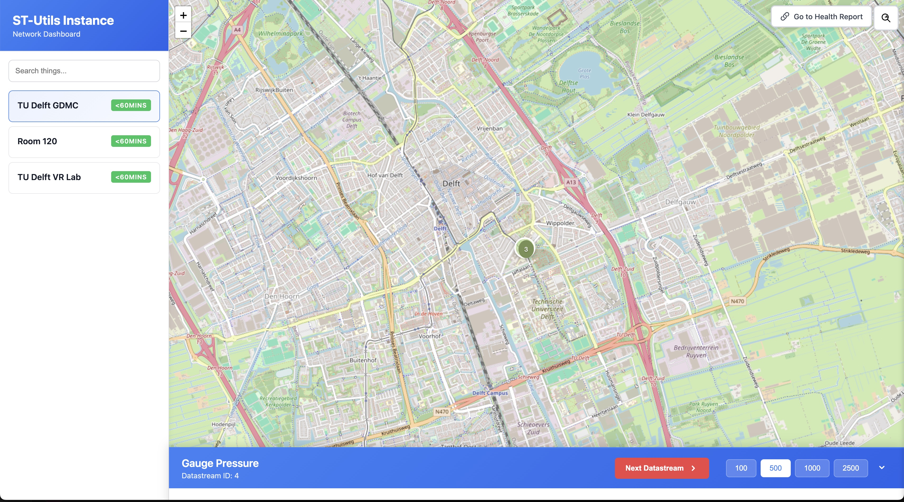
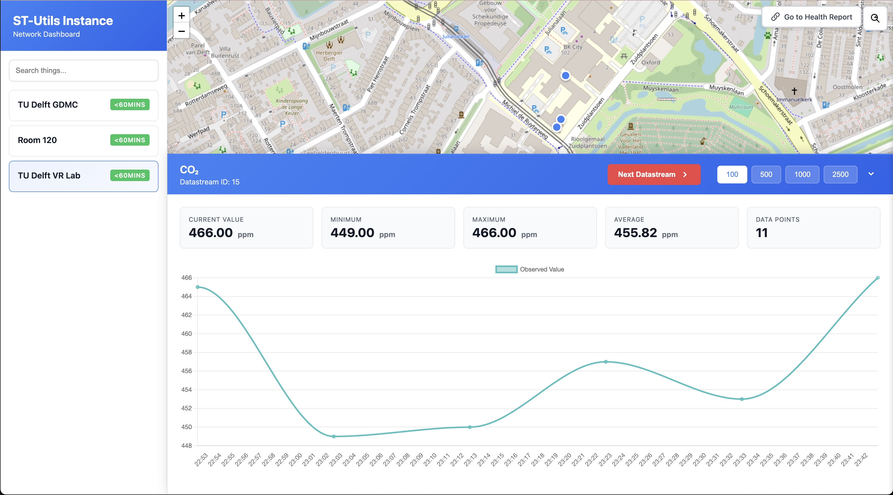
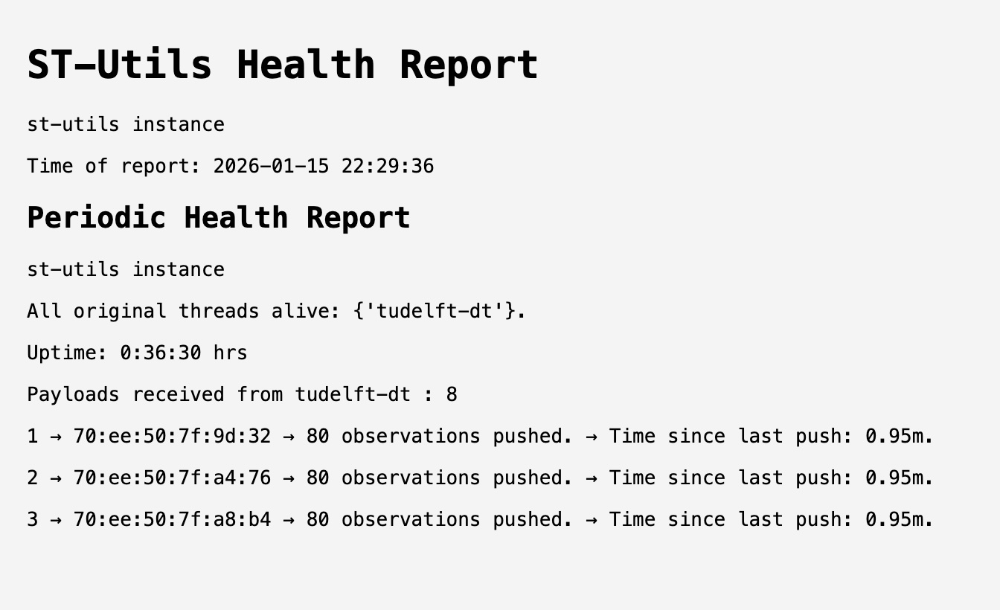

# st-utils

## What is it?

(The application currently supports a limited number of IoT applications and
sensors: this list is expected to grow.) 

**st-utils** (SensorThings Utilities) is a deployment and management layer for
Fraunhofer's [FROST Server](https://github.com/FraunhoferIOSB/FROST-Server). It
makes deploying [OGC SensorThings API
(STA)](https://www.ogc.org/publications/standard/sensorthings/) compliant sensor
IoT applications easy! The following are its features:

- Add, delete and manage IoT applications through an intuitive CLI,
- Keep your sensors STA compliant - the app takes care of transformation and
  management under the hood,
- Spin up a batteries-included web-based Sensor Dashboard,



## System Requirements

The system requirements are fairly minimal:

- `Docker` and `Docker Compose`
- `git`
- `Python >=3.9`
- Internet access

## Deployment Requirements

Deployment requires and assumes you have access (credentials) to sensor IoT
applications. More technically:

### Upstream Data Sources

You must have authenticated access to one or more Upstream Data Sources.
st-utils supports ingestion from:

- RESTful APIs: Sources providing observations via HTTP GET/POST (e.g.,
  proprietary vendor clouds)

- MQTT Brokers: Sources publishing to topics (e.g., The Things Network). 

### Sensor Specifications and Architecture

The application will help you set up the STA data mode. However, it assumes you
have enough information about the sensor *and what it is observing* to be able
to specify enough information to populate the SensorThings datamodel.


## Setup

The overall setup involves:

1. Cloning the repository,
2. Setting up mandatory internal credentials, 
3. Setting up external IoT applications and credentials,
4. Writing sensor configuration files.
5. Launching the system!

### Step 1: Clone the Repo and Create a Python Virtual Environment

```bash
git clone https://github.com/justinschembri/st-utils.git st-utils
cd st-utils
python3 -m venv .venv
source .venv/bin/activate
pip install -e .
```

### Step 2: Mandatory Internal Credentials

To quickly set up your instance of `st-utils`, use the inbuilt tooling:

```bash
$ stu setup
```

Upon the first launch of the CLI, you will be guided through setting up
mandatory internal credentials. 



The system uses default usernames (`sta-admin`) which you can accept or
override:

- **FROST**: Credentials for the FROST server (needed for data access and writing)
- **PostgreSQL**: Credentials for the backend PostgreSQL database
- **MQTT**: Internal Mosquitto users (at least one user is required)
- **Tomcat**: Web application authentication (optional)

All credentials are stored in the `deploy/secrets/credentials` directory.

### Step 3: Configure Applications

After setting up internal credentials, its time to set up the IoT applications
you have access to. Having 'access' to an IoT application means you have the
required credentials or tokens to pull data from the IoT application. See
[Supported Applications](#supported-applications) for the full list. 

Run `stu setup` if its closed and select [1] to set up the IoT applications you
have access too.  The app will guide you through the set up of (supported) HTTP
and MQTT applications:



Application are controlled by the `yaml` found in
`deploy/application_configs.yaml`

### Step 4: Configure Sensor Configurations

Each physical sensor in your network requires a configuration file that
describes the sensor, its location, the thing it monitors, and the datastreams
it produces. Again, using `stu setup` is the easiest, select item [2] and you'll
again be guided through setting up of (supported) sensors:



Sensor config are finicky `yaml` files that live in the `deploy/sensor_configs/`
directory. 

You can check the status of your applications using item [3] in the menu:



### Step 5: Start the App:

Spin up the system using `stu start`, and stop it with `stu stop`.



By default, the application starts in a "public" mode that does not implement any
*read* authentication. *Write* authentication is controlled by the FROST
credentials you should have set up earlier. If you want to start in a "private"
mode and have set up Tomcat users, then pass the --private flag: `stu start
--public`.

The application should be connecting, receiving, parsing, transforming and
storing your date. You can head over to `http://localhost:8080/st-utils` to
check this out and explore your data visually.





You can also check out the health monitor to see how your system is performing.k



## Supported Applications

st-utils supports integration with the following IoT application platforms:

- **Netatmo** (`NetatmoConnection`): HTTP-based connection to Netatmo weather
  station APIs
- **TheThingsStack (`TTSConnection`)**: MQTT-based connection to The Things
  Network

## Supported Sensor Models

The following sensor models are currently supported:

### Milesight
- **Milesight AM103L** (`milesight.am103l`): Indoor Air Quality Sensor (3-in-1)
- **Milesight AM308L** (`milesight.am308l`): Indoor Air Quality Sensor (7-in-1)

### Netatmo
- **Netatmo NWS03** (`netatmo.nws03`): Home Weather Station

